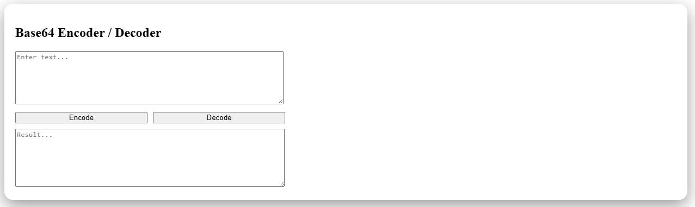
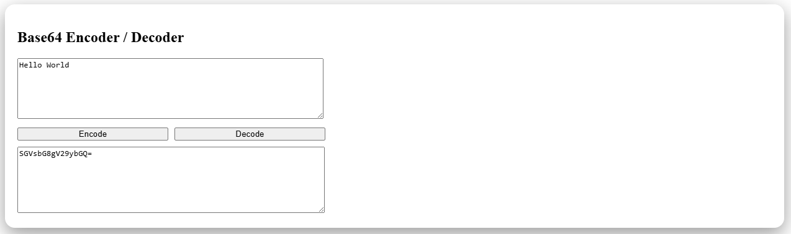

# 🔐 Base64 Encoder / Decoder


---

## Overview

A fast, minimal, and user-friendly web tool to **encode and decode Base64 strings instantly**.

Perfect for developers who need quick transformations during debugging, API testing, or data handling.

---

## Why This Project?

Base64 encoding is widely used in:
- APIs (authentication tokens)
- Image/data transfer
- Web development debugging

This tool provides a **simple, distraction-free interface** to handle it instantly.

---

## Features

- Instant encoding & decoding  
- Real-time updates  
- Clean and minimal UI  
- Fully responsive design  
- Beginner-friendly code structure  

---

## Preview

### Encode Mode


### Decode Mode


---

## Tech Stack

- HTML5  
- CSS3  
- JavaScript (Vanilla)

---

## How to Run

```bash
git clone https://github.com/your-username/base64-tool.git
cd base64-tool
```
Then open:
```bash
index.html
```

## Example

Input:
```
Hello World
```
Encoded Output:
```
SGVsbG8gV29ybGQ=
```

---

## Future Improvements

- Copy to clipboard
- File encoding support
- UTF-8 support
- Better error handling
- Dark mode

## What I Learned

- Handling text encoding/decoding logic
- DOM manipulation and event handling
- Building clean UI with minimal tools
- Writing structured, readable code

## Contributing

- Pull requests are welcome!
- Feel free to improve UI or add features.

## Show Your Support

If you found this useful, consider giving it a ⭐ on GitHub!
